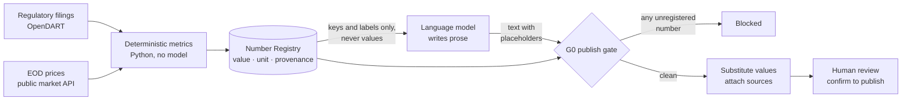

# ARC — AI Research Center

**A semi-automated equity research system for Korean sell-side analysts. Every
number in the report is computed by deterministic code; the language model is
never allowed to write one.**

ARC reads a company's regulatory filings, computes the metrics itself, and asks a
model to write prose that can only reference those numbers through placeholders.
A publish gate rejects the draft if a single figure in the body is not traceable
to a registered value. It drafts; a human confirms before anything is published.

---

## Problem

Korean brokerages cover the large caps well and the KOSDAQ small/mid caps barely
at all — there are more listed companies than analysts to follow them. The
obvious fix is to let a language model draft the notes.

That fails for a reason specific to this document type. A research note is a
**numerical** document, and one wrong figure does not degrade it — it voids it.
An analyst who finds a fabricated revenue number stops trusting every other
number on the page, including the correct ones. Fluency is not the bottleneck;
**arithmetic provenance** is.

So ARC does not ask a model to be careful with numbers. It removes the model's
ability to emit them.

## How it works



The model receives a **catalogue** — key, label, unit, direction — and never the
magnitudes. It writes `{{num:revenue_2025a}}`, not `45.4 billion won`. Since it
cannot see a value, it cannot copy one, and it cannot invent one that happens to
look plausible. Substitution happens after the gate, at the boundary.

Everything a number touches carries its origin: source, retrieval time, and the
filing URL a reviewer can open.

## Quickstart

**Requires Python 3.12+.** macOS ships 3.9, which will fail at install with
`Package 'arc' requires a different Python`. Use `uv`, `pyenv`, or a `python3.12`
binary.

```bash
git clone https://github.com/hongkevin/ai-research-center.git
cd ai-research-center
uv venv && uv pip install -e ".[dev,web]"
uv run pytest -q
```

**A fresh clone runs the full suite with no API keys, no accounts, and no
network access.** Verified by running it with the HTTP proxy pointed at a dead
port: 1,334 passed, 5 seconds. Nothing is stubbed out to make that true — tests
that need market data carry committed fixtures, and tests that need a model use
a fake client.

21 tests skip. All of them are Postgres integration tests that opt in through
`ARC_TEST_DATABASE_URL`; they are skipped rather than silently passing, and the
skip reason names the missing variable.

To generate an actual report you need an [OpenDART](https://opendart.fss.or.kr)
key (filings) and a [data.go.kr](https://www.data.go.kr) key (prices); a model
key is optional and its absence downgrades prose to deterministic sentences
rather than failing. Copy `.env.example` to `.env`. See
[docs/DEPLOY.md](docs/DEPLOY.md) for running the web workbench.

## What this does not do

- **No price targets, no investment opinions, no buy/sell language.** This is a
  product boundary, not a missing feature — the publish gate blocks the words. A
  note that says "the multiple re-rated" is in scope; one that says "we see 30%
  upside" is refused.
- **No consensus estimates and no peer-average multiples from data vendors.**
  Those are licensed products. Where a number would need one, the screen says so
  instead of substituting something weaker.
- **It is not autonomous.** Nothing publishes without a human confirming. The
  gate decides what *may* be published, never what *is*.
- **Korean market only.** KOSPI and KOSDAQ, via OpenDART and the Financial
  Services Commission price API. The US data adapter is an interface stub.
- **It is not a production system** and not investment advice.

## Evidence

Every claim below has a command next to it. Run them.

| Claim | Verify |
| --- | --- |
| The whole suite passes with no keys or network | `uv run pytest -q` → 1,334 passed, 21 skipped (Postgres, opt-in) |
| Unregistered numbers are blocked from publishing | `uv run pytest tests/test_g0.py -q` → 23 passed, incl. `test_unregistered_literal_blocks` |
| Price-target and opinion language is blocked | same file, `TestComplianceD4::test_opinion_blocked` |
| Segment revenue reconciles to the income statement | `uv run pytest tests/test_segments.py tests/test_segment_profit.py -q` → 62 passed |
| The naive projection baseline was measured, not assumed | `uv run pytest tests/test_backtest.py -q`; result in [decisions.md D34](docs/decisions.md) — 100 KOSDAQ names × 4 years, **median revenue error 18.5%**, operating income within **4.7pp** of revenue error, direction correct **81%** |
| Peer groups beat a random basket | [`src/arc/data/sectors.py`](src/arc/data/sectors.py) header — market-beta-removed intra-group correlation **0.31–0.47** against a measured random-basket baseline of **0.102** |
| Cost per report is real, not projected | [decisions.md D14](docs/decisions.md) — **$0.0019** measured, against a design-doc estimate of $0.5–0.9 |
| A failing eval blocks the build | `uv run arc-evals` → exit 0; raise a floor in [`evals/baselines.json`](evals/baselines.json) and it exits 1 |

Two of those numbers exist because the measurement contradicted the plan. The
throughput hypothesis behind the original design was **rejected** by an analyst
interview and is struck through in the open-questions table; the projection
baseline turned out good enough that the model was scoped down around it.

## Evals

[`evals/`](evals/) holds the gate that decides whether a change may ship. It runs
on every push, needs no key, and can fail:

```bash
uv run arc-evals     # exit 1 if a committed floor is breached
```

The first suite covers the stock-name classifier, which is the kind of failure
G0 structurally cannot see — loosen the boundary rules and the text stays
well-formed, no numbers appear, the publish gate is satisfied, and a stock
nobody mentioned shows up on the sentiment screen. One of its three bounds is
**zero**, with the reason committed next to it.

[`evals/README.md`](evals/README.md) states what the gate does **not** cover,
starting with the largest hole: nothing here measures whether the chat retrieved
the right report card to answer from.

## Design record

[`docs/decisions.md`](docs/decisions.md) is the single source of truth for why
this system is shaped the way it is — **86 numbered decisions**, each with what
was measured, what was rejected, and what would reverse it. It records failures
in the same place as successes: a gate that was enabled but not enforced, a
region migration whose benefit was measured on the wrong machine, a test suite
that passed only between 4pm and 9am.

**It is written in Korean.** The domain is Korean disclosure regulation and the
reasoning is more precise in the language the source documents use. This README,
the code identifiers, and the module docstrings' structure are English; the
decision log is not, and translating it would cost fidelity for an audience that
mostly wants the summary above.

Other maps: [docs/ARCHITECTURE.md](docs/ARCHITECTURE.md) (pipeline, gates, data
layer) · [docs/HANDOFF.md](docs/HANDOFF.md) (current state) ·
[web/README.md](web/README.md) (the screen).

## Layout

```
src/arc/
├── data/       providers — OpenDART filings, FSC prices, ECOS macro, news
├── finmodel/   deterministic computation — metrics, segments, estimates,
│               valuation, peer correlation, backtest
├── llm/        model client, Number Registry, Korean particle correction
├── verify/     G0 publish gate
├── pipeline/   S1–S6 orchestration
├── render/     HTML with per-number provenance, charts, DOCX/XLSX
└── web/        API, auth, job queue (SSE), static serving

templates/      report templates (outside the wheel; ARC_TEMPLATE_DIR)
web/            Next.js + Tailwind + shadcn/ui, static export
corpus/         committed research inputs — award tables, report metadata
docs/           decisions, architecture, research notes
```

## License

MIT — see [LICENSE](LICENSE).

This is an independent portfolio project. It is not affiliated with, endorsed
by, or built for any brokerage, and it contains no client or employer material.
