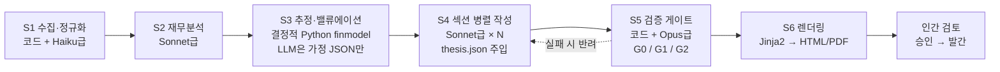

# AI Research Center — 설계 문서 (v1)

> 2026-07-25 설계 논의 확정본. 근거 조사와 대안 비교는 [design-brief-v1.md](design-brief-v1.md) 참조.

## 1. 프로젝트 정의

증권사 리서치센터의 RA(Research Assistant) 역할을 AI로 대체하는 **종목 보고서 자동 생성 시스템**.

- 구조: **세미오토** — AI가 초안을 생성하고, 사람이 검토·승인한 뒤 발간한다. 시스템의 목표는 "완벽한 보고서"가 아니라 **검토자의 시간을 최소화하는 신뢰 가능한 초안 + 검증 근거 제공**이다.
- 최종 목표: **사업화 (B2C/B2B)**. 무료·일방향 발간으로 실적과 골든셋을 축적한 뒤 유료화(유사투자자문업 신고) 또는 증권사 제휴(B2B)로 전환한다.

## 2. 확정 결정 로그

| # | 결정 | 선택 | 핵심 근거 |
|---|---|---|---|
| D1 | 제품 포지셔닝 | 세미오토 (AI 초안 + 인간 검토 후 발간) | 국내외에서 유일하게 검증된 발간 공식. 규제·품질 리스크 양면 최소화 |
| D2 | 타깃 시장 | **아키텍처는 KR+US 추상화, 발간 콘텐츠는 KR 우선** | 코스닥 미커버(상장사 ~60%가 리포트 0건) 공백이 차별화 지점. US는 EDGAR 어댑터 추가로 v2 확장 |
| D3 | 첫 보고서 유형 | 실적 리뷰 노트 (2~6p) × 코스닥 미커버 종목 | 입출력이 가장 정형적. 어닝시즌마다 발행 리듬 생성. 미커버 종목엔 리뷰조차 없어 즉시 가치 |
| D4 | 목표주가 | **단일 목표주가·투자의견 출력 금지** → 적정가치 범위 + 감도표 + 산식 전면 공개 | 금감원 '투자권유' 규제 검토 회피 + '근거 투명성'을 차별화 축으로 |
| D5 | 배포 모델 | 무료·일방향으로 시작 | 인허가 제로. 유료화는 유사투자자문업 신고와 함께 별도 결정 |
| D6 | 데이터 전략 | 무료 조합(OpenDART·금융위시세·네이버뉴스) + 소액 유료 여지 | 컨센서스는 MVP 제외(합법적 무료 경로 없음). FnGuide 계약은 유료화 시점을 트리거로 |
| D7 | 아키텍처 | 파이프라인형(B) + 섹션 병렬 팬아웃(C) 하이브리드 | 재현성·감사 가능성·환각 통제 우선. Batch API 50% 할인으로 건당 비용 최저 |

## 3. 규제 가드레일 (제품 불변식)

코드 레벨에서 강제하는 불변식이다. 위반 출력은 검증 게이트(G0)에서 발간 차단된다.

1. **단일 목표주가·Buy/Hold/Sell 출력 금지.** 밸류에이션은 시나리오 3개(보수/기준/낙관) + 감도표 + 산출 산식 전면 공개 형태만 허용.
2. **무료·일방향 배포만.** 유료화는 유사투자자문업 신고 후. **유료 + 양방향(채팅 Q&A) 결합은 절대 금지** — 투자자문업 등록 대상으로 점프한다 (2024.8.14 시행 개정 자본시장법).
3. **3중 디스클레이머 필수 포함**: ① 조사분석자료 아님 ② 투자권유 아님 ③ AI 생성물 표시 (AI 기본법 제31조).
4. **단정적 가치판단 표현 차단.** "매수해야", "확실히 상승" 류 표현은 룰 필터로 차단.
5. **재배포 가능 데이터만 보고서에 노출**: OpenDART, 금융위 공공데이터, (v2) SEC EDGAR. KRX OpenAPI·크롤링 데이터는 내부 분석용으로도 사용하지 않는 것을 원칙으로 한다.

## 4. 시스템 아키텍처

### 4.1 파이프라인



| 단계 | 역할 | 실행 주체 |
|---|---|---|
| S1 수집·정규화 | DART 공시·재무, 시세, 뉴스 수집 → 표준 스키마 정규화 | 결정적 코드 (+ 비정형 텍스트 정리에 Haiku급) |
| S2 재무분석 | 실적 특징·변화 요인 분석, 투자 논지(thesis.json) 생성 | Sonnet급 |
| S3 추정·밸류에이션 | 실적 추정, 멀티플 밴드, 시나리오·감도표 계산 | **결정적 Python (finmodel)**. LLM은 가정값(성장률 등)을 JSON으로 제안만 하고, 계산은 전부 코드 |
| S4 섹션 작성 | 요약/투자포인트/실적분석/밸류에이션/리스크 섹션 병렬 생성 | Sonnet급 × 섹션 수 (thesis.json + Number Registry 주입) |
| S5 검증 게이트 | 아래 4.3 | 코드 + Opus급 |
| S6 렌더링 | Markdown → HTML/PDF (WeasyPrint) | 결정적 코드 |

### 4.2 핵심 원칙: 숫자는 코드만 생성한다 (Number Registry)

수치 환각이 이 도메인 최대 리스크다 (기존 환각 탐지기가 산술 오류의 43%를 놓친다는 연구 — FinGround 2026). 대응은 **사후 탐지가 아니라 경로 차단**:

- 보고서에 등장 가능한 모든 수치는 S1~S3의 결정적 코드가 계산해 **Number Registry**에 등록된다 (값 + 단위 + provenance).
- LLM은 본문에서 숫자 리터럴 대신 **플레이스홀더**(`{{rev_2026e}}`)만 쓴다. 렌더링 시 레지스트리 값으로 치환.
- 레지스트리에 없는 숫자가 본문에 나타나면 G0에서 발간 차단.
- 모든 데이터 포인트는 provenance(원천, 조회 시각, 원문 URL/공시 번호)를 갖는다 — 인간 검토 화면에서 클릭 추적 가능해야 한다.

### 4.3 검증 게이트

| 게이트 | 내용 | 도입 시점 |
|---|---|---|
| **G0 (하드, 비타협)** | 수치 원천 대조 100% (Number Registry 강제), 컴플라이언스 룰 필터(§3 불변식), 필수 섹션·디스클레이머 존재 확인 | **MVP 필수** |
| G1 | 문장 단위 grounding 검증 (주장 ↔ 원천 데이터 대응) | 골든셋 구축 후 |
| G2 | LLM-as-judge 루브릭: 사실성 / 논리 일관성 / 완결성 / 컴플라이언스 4축 | 골든셋 구축 후 |

골든셋: 실제 증권사 리포트 20~30건과의 블라인드 비교 프로토콜. 한국어 리포트 품질 벤치마크는 전무하므로 골든셋 자체가 핵심 데이터 자산이다.

### 4.4 모델·비용

| 용도 | 모델 (2026-07 기준) | 단가 (input/output per 1M tokens) |
|---|---|---|
| 정규화·경량 처리 | claude-haiku-4-5 | $1 / $5 |
| 분석·작성 | claude-sonnet-5 | $3 / $15 (2026-08-31까지 인트로 $2/$10) |
| 검증·감수 | claude-opus-5 | $5 / $25 |

- 비실시간 생성은 **Batch API(50% 할인)** 기본. 반복 컨텍스트(공시 원문 등)는 prompt caching.
- 건당 추정 비용 ≈ **$0.5~0.9** (배치 기준, ±50% — 3~4주차 10종목 파일럿에서 실측 보정이 go/no-go 게이트).
- 월 예상: 100종목 주 1회 기준 $200~400.

## 5. 데이터 레이어

### 5.1 DataProvider 추상화 (KR+US 대비)

시장 중립 인터페이스 뒤에 시장별 어댑터를 붙인다. 도메인 모델(Company, FinancialStatement, PricePoint, Disclosure, NewsItem)은 시장 공통.

| 어댑터 | 소스 | 용도 | 비고 |
|---|---|---|---|
| `kr/dart` | OpenDART API | 재무제표(XBRL), 공시 원문, 기업 개황 | 무료, 일 20,000건, 재배포 안전. **핵심 기둥** |
| `kr/krx_price` | 금융위 주식시세정보 API (data.go.kr) | EOD 시세 (D+1) | "이용허락범위 제한 없음". 실적 리뷰엔 EOD로 충분 |
| `kr/naver_news` | 네이버 뉴스 검색 API | 뉴스 스니펫 | 일 25,000회. 본문 크롤링 금지 — 스니펫+공시 원문만 근거로 |
| `us/edgar` (v2) | SEC EDGAR | US 재무·공시 | 퍼블릭 도메인. v2에서 구현 |

**배제**: KRX Open API(비상업·재배포 금지), 네이버 금융/FnGuide 크롤링(DB권 침해 판례), pykrx 류 의존(프로토타입 한정). 컨센서스 데이터는 MVP 제외 — 자체 밸류에이션(과거 밴드·피어 멀티플)으로 대체.

### 5.2 저장소

- **DuckDB + Parquet**, **point-in-time 버전 관리** (조회 시점 기준 as-of 조회 지원).
- 처음부터 point-in-time으로 짓는 이유: 이후 백테스트("과거 시점 데이터만으로 생성한 보고서가 유효했는가")가 품질 증명의 핵심이기 때문.

## 6. MVP 보고서 스펙 — 실적 리뷰 노트

- 분량 2~6p, 대상: 코스닥 미커버 종목 30개(어닝시즌 집중)로 시작 → 100개(분기+이벤트 트리거) 확장.
- 섹션 구성:
  1. 헤더 (기본정보: 종목·시장·산업·시총·주가)
  2. 요약 (3~5줄)
  3. 투자포인트 2~4개
  4. 실적 분석 (발표 실적 vs 전기·전년 비교 테이블 + 서술)
  5. 실적 추정 (추정 가정 명시, **전 보고서 대비 추정 변화 추적** — 핵심 차별화)
  6. 밸류에이션: 시나리오 3개 + 감도표 + 산식 공개 (단일 목표주가 없음)
  7. 리스크 요인
  8. 디스클레이머 (3중)

## 7. 저장소 구조 (계획)

```
ai-research-center/
├── docs/                   # 설계 문서
├── src/arc/
│   ├── data/               # 데이터 레이어
│   │   ├── base.py         #   도메인 모델 + DataProvider 인터페이스 (provenance 포함)
│   │   ├── kr/             #   dart.py, krx_price.py, naver_news.py
│   │   └── us/             #   edgar.py (v2 스텁)
│   ├── store/              # DuckDB+Parquet point-in-time 저장
│   ├── finmodel/           # 결정적 계산: 추정·멀티플·시나리오·감도표
│   ├── pipeline/           # S1~S6 오케스트레이션
│   ├── llm/                # Claude 클라이언트, 프롬프트, Number Registry
│   ├── verify/             # 검증 게이트 G0/G1/G2
│   └── render/             # Jinja2 → HTML/PDF
├── templates/              # 보고서 템플릿
├── tests/
├── pyproject.toml
└── README.md
```

## 8. 로드맵 (6~8주)

| 주차 | 목표 | 산출물 |
|---|---|---|
| 1~2 | 데이터 레이어 | OpenDART·금융위시세·네이버뉴스 어댑터, point-in-time 저장소 |
| 3~4 | 계산 레이어 + 파이프라인 골격 | finmodel, S1~S3 관통, **10종목 파일럿 비용 실측 (go/no-go)** |
| 5~6 | 생성 + 검증 | S4 섹션 병렬 작성, G0 게이트, Number Registry, HTML/PDF 렌더링 |
| 7~8 | 평가 + 시범 발행 | 골든셋 20~30건 블라인드 비교, 디스클레이머 확정, 30종목 시범 발행 |

## 9. 톱 리스크 (요약)

| 리스크 | 완화 |
|---|---|
| 규제 재해석 (AI 리포트 '투자권유' 검토 확산) | §3 가드레일 + 규제 동향 분기 모니터링 |
| 수치 환각 | Number Registry + G0 하드 게이트 + 인간 검토 |
| 데이터 라이선스 | 재배포 안전 소스만 노출 (§5.1 배제 목록 준수) |
| 품질 천장 (템플릿형 대량 생성 함정) | 추정 변화 추적 + 산식 공개 = '검증 가능성' 차별화, 확장보다 깊이 |
| 경쟁 선점 (KOSAI 등) | 실사 진행 중. 미커버+투명성 틈새 집중, 골든셋·point-in-time DB 등 복제 어려운 자산 조기 축적 |

상세 근거·출처는 [design-brief-v1.md](design-brief-v1.md).
